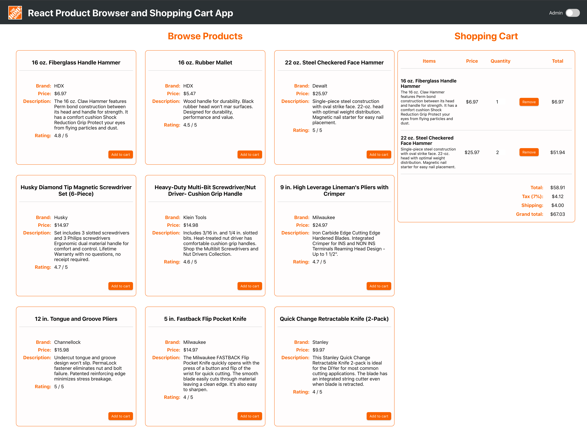

# Product Browser

## Description

This is a React application demonstrating both stateful and stateless React components. You can use this as a demo app or as a starter repo for React exercises.

This app uses `axios` to make RESTful calls to a server. A simple `json-server` is provided. To start the server run `yarn server`.

